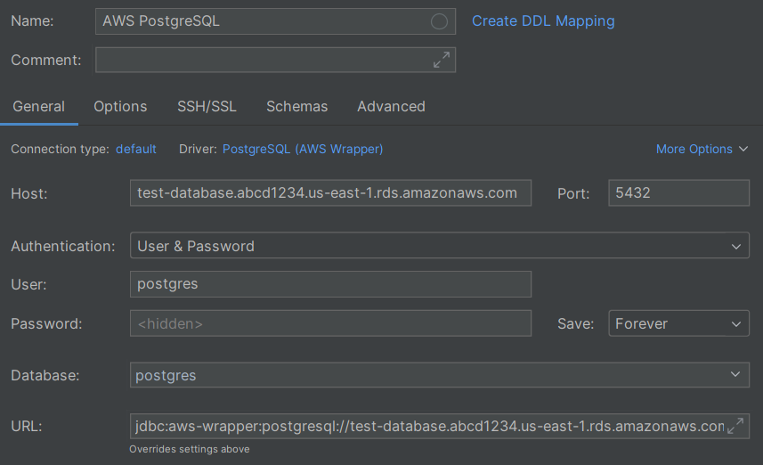
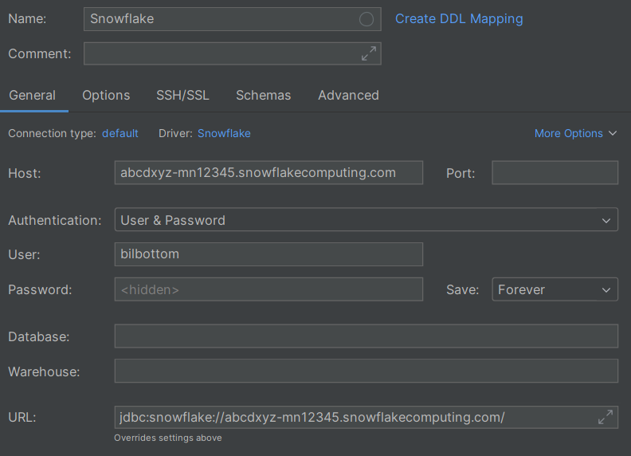

# Managed services

> [!SUCCESS] **Who's this section for?**
>
> _"I want my own data to be securely accessible from multiple machines."_

Managed services are usually very little work to get started with, and there is security so that appropriate people can access the data. You don't need to install anything, and you can use them from any machine with internet access.

While they can be expensive, they are a popular option for companies and often have their own web GUIs that you can use.

There are options for [OLTP](https://en.wikipedia.org/wiki/Online_transaction_processing) workloads (application backends) and [OLAP](https://en.wikipedia.org/wiki/Online_analytical_processing) workloads (data warehouses). Software engineers will mainly write SQL for OLTP workloads, while data folk (engineers, analysts, scientists) will mainly write SQL for OLAP workloads.

Some popular managed services for each are below:

<center>

| Application backends                                                       | Data warehouses                               |
| -------------------------------------------------------------------------- | --------------------------------------------- |
| [AWS Options](https://aws.amazon.com/rds/)                                 | [Databricks](https://www.databricks.com/)     |
| [Microsoft Options](https://azure.microsoft.com/en-gb/products/#databases) | [Snowflake](https://www.snowflake.com/)       |
| [Google Options](https://cloud.google.com/sql)                             | [BigQuery](https://cloud.google.com/bigquery) |
|                                                                            | [Firebolt](https://www.firebolt.io/)          |
|                                                                            | [MotherDuck](https://motherduck.com/)         |

</center>

The dialect options for the application backends depend on the provider, but they usually include [PostgreSQL](https://www.postgresql.org/), [MySQL](https://www.mysql.com/), and [SQL Server](https://www.microsoft.com/en-gb/sql-server/).

Each of the data warehouse platforms has their own SQL dialect (other than MotherDuck, which runs [DuckDB](https://duckdb.org/)). While they are all based on SQL, they have different features and syntax.

---

**Using a managed service**

The managed services will explain how to use them, but it's worth walking through two examples; we'll use:

- PostgreSQL on AWS RDS for an application backend
- Snowflake for a data warehouse

**PostgreSQL on AWS RDS (application backend)**

Follow the instructions in the [AWS RDS documentation](https://docs.aws.amazon.com/AmazonRDS/latest/UserGuide/Welcome.html) to create a free-tier PostgreSQL database. You'll probably need to configure your security rules -- the link below shows how to open the database to the public (not recommended for production use), but you can also restrict access to your own IP address.

- [https://stackoverflow.com/a/52346331/8213085](https://stackoverflow.com/a/52346331/8213085)

Once your database is ready to go, you can grab the connection details from the _Connectivity & security_ tab in the database details page.

The important details you'll need are:

- **Endpoint**: `<instance-name>.<unique-id>.<region>.rds.amazonaws.com`
- **Port**: `5432` (for PostgreSQL)
- **Username**: `postgres`, or whatever you set it to when creating the database
- **Password**: You would have set this when creating the database

For example, suppose the instance name was `test-database`, the unique ID was `abcd1234`, and the region was `us-east-1`.

Here's an example of how to use these details in [IntelliJ](https://www.jetbrains.com/):

<center>

{: style="width:500px"}

</center>

...and similarly, how to use them in Python with [the psycopg2 library](https://www.psycopg.org/docs/):

```python
import psycopg2

def main() -> None:
    db_conn = psycopg2.connect(
        " ".join([
            "host=test-database.abcd1234.us-east-1.rds.amazonaws.com",
            "port=5432",
            "user=postgres",
            "password=...",
        ])
    )

    with db_conn.cursor() as cursor:
        cursor.execute("select version()")
        print(cursor.fetchone()[0])


if __name__ == "__main__":
    main()
```

**Snowflake (data warehouse)**

You can sign up for a free trial of Snowflake at:

- [https://signup.snowflake.com/](https://signup.snowflake.com/)

Similar to PostgreSQL on AWS, the important details are:

- **Account Identifier**: This is either set by you, or generated by Snowflake
- **Username**: This is the username you chose when signing up (most likely your email)
- **Password**: This is the password you chose when signing up

You can add additional usernames and passwords later, but for now, use the ones you set when signing up. Combine the account identifier with `snowflakecomputing.com` (and [possibly the cloud region](https://docs.snowflake.com/en/user-guide/organizations-connect)) to make the host name:

- `<account-identifier>.snowflakecomputing.com`

If you signed up for a free trial, the "account identifier" will be the generated organisation name with the generated account name. You can find this in the URL when you log in to Snowflake:

- `https://app.snowflake.com/abcdxyz/mn12345/#/homepage`

The account identifier for the URL above is `abcdxyz-mn12345`.

Here's an example of how to use these details in [IntelliJ](https://www.jetbrains.com/):

<center>

{: style="width:500px"}

</center>

...and similarly, how to use them in Python with [the snowflake-connector-python library](https://docs.snowflake.com/en/user-guide/python-connector.html):

```python
import snowflake.connector

def main() -> None:
    db_conn = snowflake.connector.connect(
        account="abcdxyz-mn12345",
        user="bilbottom",
        password="...",
    )

    with db_conn.cursor() as cursor:
        cursor.execute("select current_version()")
        print(cursor.fetchone()[0])


if __name__ == "__main__":
    main()
```

> [!WARNING]
>
> If you use a managed service, make sure you understand and monitor the costs so that you don't end up spending over your budget.
