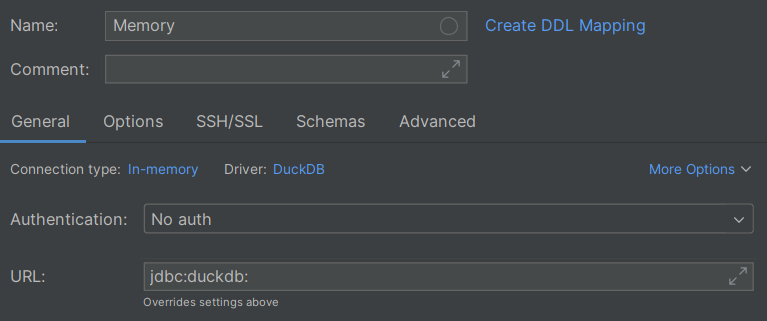

# Single-file databases

> [!SUCCESS] **Who's this section for?**
>
> _"I want my data to be on my machine, without installing much software."_

Some databases are very simple to set up and use, such as [SQLite](https://sqlite.org/) and [DuckDB](https://duckdb.org/):

- [SQLite](https://sqlite.org/) is appropriate to use as an application backend (OLTP workloads)
- [DuckDB](https://duckdb.org/) is appropriate to use for analytics (OLAP workloads)

These don't require as much installation as other typical database engines (more on this in the next two sections).

If you're a software engineer, you'll likely want to use SQLite; if you're a data person, you'll likely want to use DuckDB.

You'll need to install _some_ software to use them, but the software depends on how you intend to use them. Some examples are below.

The instructions documented in [Connecting to databases](connecting-to-databases.md) will work for SQLite and DuckDB, but SQLite and DuckDB are _slightly_ different from other databases. Instead of connecting to a server (using a host and port), you either:

1. Connect to a file on your machine by specifying the path to the file
2. Use an in-memory database by specifying the special value `:memory:`

In the first case, the file is created if it doesn't exist and any data you create (e.g. tables) is stored in that file. This makes it easy to share the database with others: just send them the file!

The in-memory option is useful for short-lived databases, such as for testing or development. When you close the connection, any data you created is lost.

SQLite and DuckDB specific connection details are given below.

## Using an IDE

Here are examples of connecting to SQLite and DuckDB using [IntelliJ](https://www.jetbrains.com/).

**Connecting to a file**

<center>

{: style="width:500px"}
{: style="width:500px"}

</center>

Note that you can call the database files whatever you want. I've used `.sqlite` and `.duckdb` as the file extensions for clarity, but it's also common to just use `.db` as the extension.

**Connecting to an in-memory database**

<center>

{: style="width:500px"}
{: style="width:500px"}

</center>

## Using a terminal

If you want to use SQLite or DuckDB in your terminal, you can install them using the package manager for your operating system:

- [https://sqlite.org/download.html](https://sqlite.org/download.html)
- [https://duckdb.org/docs/installation/](https://duckdb.org/docs/installation/)

After you install the command line tools, you can run them from your terminal like other SQL CLI tools. The only difference is that instead of providing a host and port, you either:

- Provide a file path to the database file
- Don't provide a file path to use an in-memory database

```shell
# physical file
sqlite3 "path\to\your\file.sqlite"
duckdb "path\to\your\file.duckdb"

# in-memory
sqlite3
duckdb
```

Check the database documentation for additional details:

- [https://sqlite.org/cli.html](https://sqlite.org/cli.html)
- [https://duckdb.org/docs/stable/clients/cli/overview.html](https://duckdb.org/docs/stable/clients/cli/overview.html)

From DuckDB version [v1.2.1](https://github.com/duckdb/duckdb/releases/tag/v1.2.1), the CLI includes a `-ui` argument which launches a web-based GUI for DuckDB. See more details at:

- [https://duckdb.org/2025/03/12/duckdb-ui.html](https://duckdb.org/2025/03/12/duckdb-ui.html)

## Using a programming language

If you want to use SQLite or DuckDB in a programming language, you can install the appropriate libraries for your language.

For example, Python comes with SQLite ([the `sqlite3` standard library module](https://docs.python.org/3/library/sqlite3.html)) and you can install [the DuckDB library](https://duckdb.org/docs/stable/clients/python/overview):

```python
# pip install duckdb

import sqlite3
import duckdb

# Connect to a file
sqlite_conn = sqlite3.connect("path/to/your/file.sqlite")
duckdb_conn = duckdb.connect("path/to/your/file.duckdb")

# Connect to an in-memory database
sqlite_conn = sqlite3.connect(":memory:")
duckdb_conn = duckdb.connect()
```

Note that the DuckDB Python library also supports using the `duckdb` package for SQL operations directly (that is, without needing to first create a connection) which will automatically run them in memory:

```python
import duckdb

duckdb.sql("select 42").show()
```

Check the documentation to see whether these databases are supported the language you're using. The DuckDB client libraries are documented at:

- [https://duckdb.org/docs/stable/clients/overview](https://duckdb.org/docs/stable/clients/overview)
