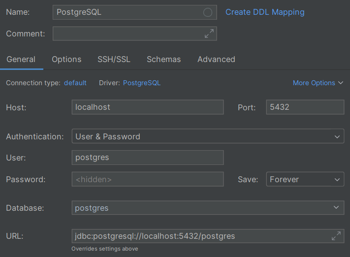

# DBMS system (Docker)

> [!SUCCESS] **Who's this section for?**
>
> _"I want local databases without having to install vendor-specific software."_

> [!TIP]
>
> This is the approach I recommended for most people.

[Docker](https://www.docker.com/) is a great tool for running software by "installing" it into ["Docker containers"](https://www.docker.com/resources/what-container/). Docker allows you to configure the software you want with code, making it easier to share and reproduce.

The additional complexity with Docker is that it's an extra tool to learn, and some bits require additional configuration (such as persisting data). However, for local testing and development, Docker is a great option.

Connecting to databases running in Docker is very similar to connecting to databases running locally. Note that, while the databases are great to run with Docker, the SQL GUIs are not; you'll typically still want to install them "normally" on your machine.

It's common to use Docker's [Compose](https://docs.docker.com/compose/) tool to run multiple containers at once. This article is not a Docker tutorial so we'll continue with the assumption that you know how to use Docker and Docker Compose, but check out the [Docker documentation](https://docs.docker.com/get-started/) if you need help.

---

**Using Docker for a DBMS**

Here's a minimal example of a `docker-compose.yaml` file which configures SQL Server, MySQL, and PostgreSQL databases.

```yaml
services:
  mssql:
    image: mcr.microsoft.com/mssql/server:2022-latest
    container_name: SQL-Server
    ports: ["1433:1433"]
    volumes: ["./data/mssql:/var/opt/mssql/data"]
    environment:
      ACCEPT_EULA: "Y"
      MSSQL_PID: Developer
      # username is `SA`
      MSSQL_SA_PASSWORD: Test@12345

  mysql:
    image: mysql:8.4.3
    container_name: MySQL
    ports: ["3306:3306"]
    volumes: ["./data/mysql:/var/lib/mysql"]
    environment:
      # username is `root`
      MYSQL_ROOT_PASSWORD: Test@12345

  postgres:
    image: postgres:17.4
    container_name: PostgreSQL
    ports: ["5432:5432"]
    volumes: ["./data/postgres:/var/lib/postgresql/data"]
    environment:
      POSTGRES_USER: postgres
      POSTGRES_PASSWORD: Test@12345
```

Then, you can launch these with `docker compose up` and connect to them in the way that you want. You can configure each of the databases to use different values: the above is just a minimal example.

The `volumes` property is important for persisting data on the machine that Docker is running on between runs. If you don't set this, the data will be lost when the container is stopped.

Here's an example of how to connect to these in [IntelliJ](https://www.jetbrains.com/):

<center>

{: style="width:500px"}
{: style="width:500px"}
{: style="width:500px"}

</center>

...and similarly, how to connect to them in Python with their corresponding libraries ([pyodbc](https://learn.microsoft.com/en-us/sql/connect/python/pyodbc/python-sql-driver-pyodbc) for SQL Server, [mysql-connector-python](https://dev.mysql.com/doc/connector-python/en/) for MySQL, [psycopg2](https://www.psycopg.org/docs/) for PostgreSQL):

```python
import mysql.connector  # MySQL
import psycopg2  # PostgreSQL
import pyodbc  # SQL Server

def main() -> None:
    mssql_conn = pyodbc.connect(
        "Driver={SQL Server};"
        "Server=localhost;"
        "Port=1433;"
        "UID=SA;"
        "PWD=Test@12345;"
    )
    mysql_conn = mysql.connector.connect(
        host="localhost",
        port=3306,
        user="root",
        password="Test@12345",
        use_pure=True,  # you may not need this
    )
    postgres_conn = psycopg2.connect(
        " ".join([
            "host=localhost",
            "port=5432",
            "user=postgres",
            "password=Test@12345",
        ])
    )

    with mssql_conn.cursor() as cursor:
        cursor.execute("select @@version")
        print("SQL Server version:", cursor.fetchone()[0])

    with mysql_conn.cursor() as cursor:
        cursor.execute("select version()")
        print("MySQL version:", cursor.fetchone()[0])

    with postgres_conn.cursor() as cursor:
        cursor.execute("select version()")
        print("PostgreSQL version:", cursor.fetchone()[0])


if __name__ == "__main__":
    main()
```
