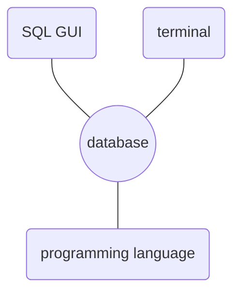
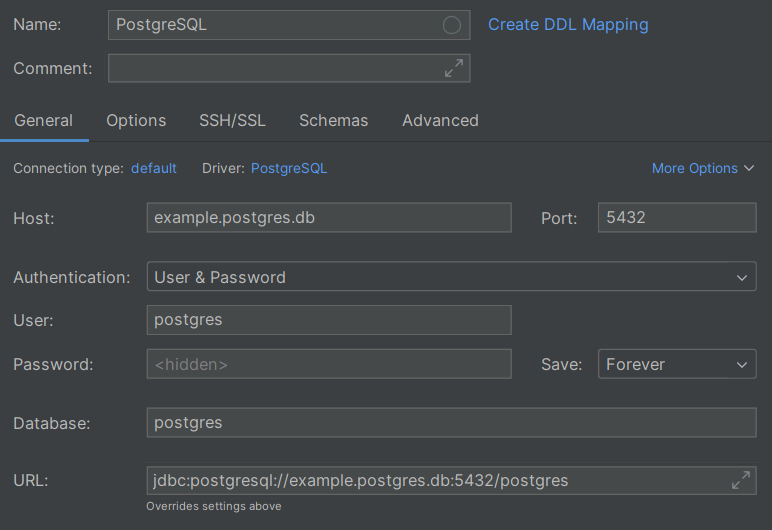
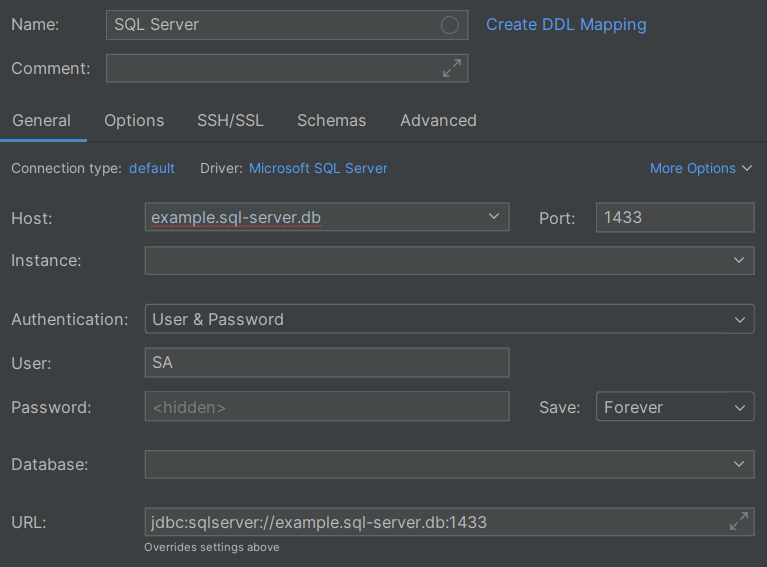
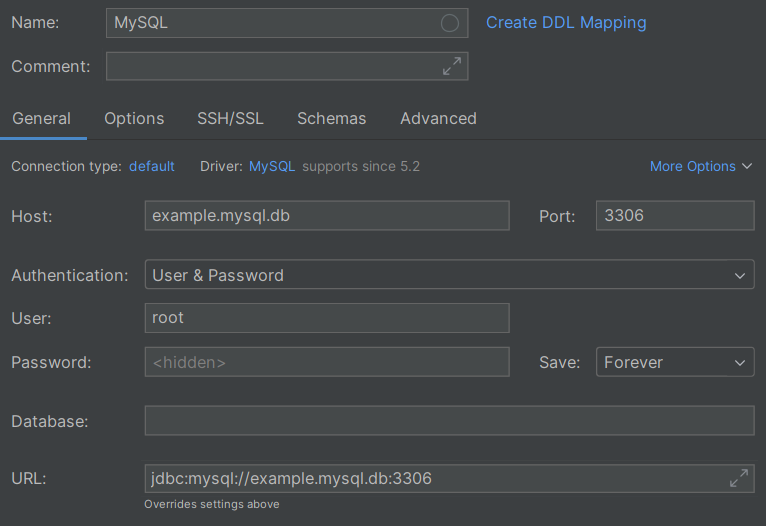
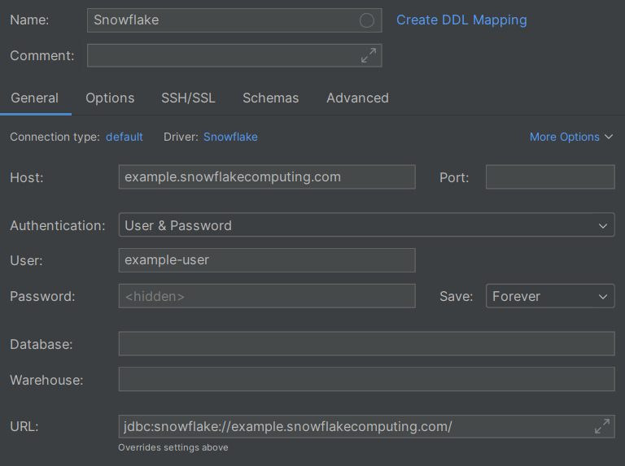
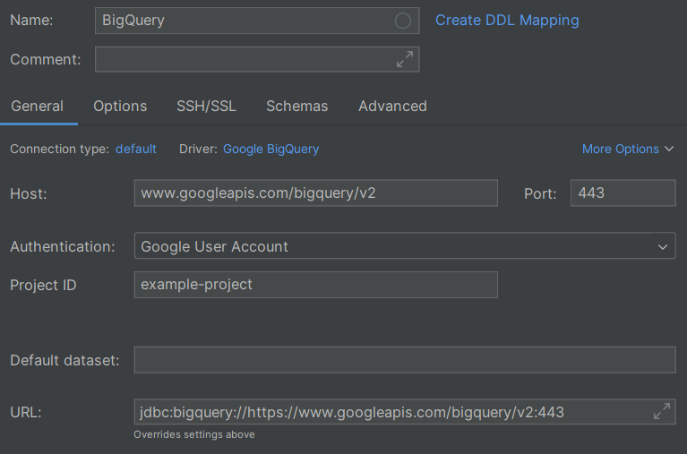
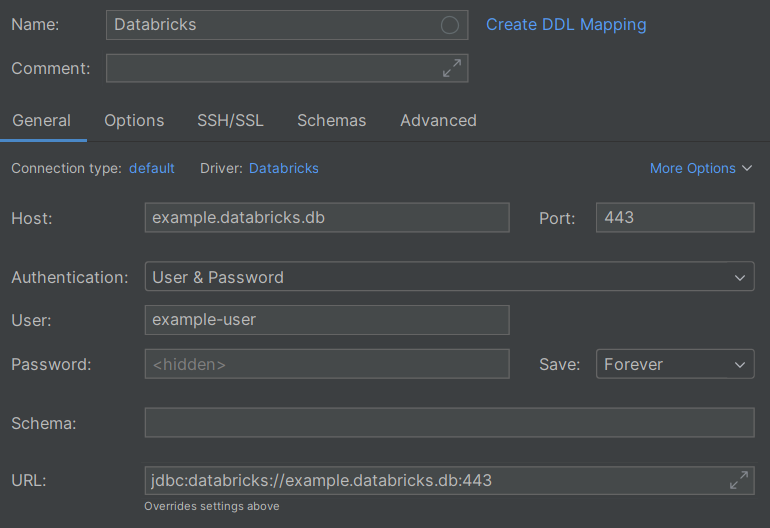

# Connecting to databases

> [!NOTE] ""
>
> Since SQL is super common and used in many different ways, there are also many different ways to connect to databases.

## Connection options

As a user, there are three main ways to connect to databases:

- Using a SQL GUI (_Graphical User Interface_) application
- Using a CLI (_Command Line Interface_) tool in your terminal
- Using a programming language

<center>



</center>

In each case, you'll _generally_ need the same information about the database:

- The "URL" of the database, often called the _host_
- The port that the database is available on
- Some authentication credentials, such as a username and password

We'll walk through a few options for each way of connecting to databases.

> [!TIP]
>
> Although we're only covering a few options here, there are many more options available -- such as connecting Excel to a database.

## Using a SQL GUI

> [!SUCCESS] A great option for most people
>
> SQL GUIs are great for most people because they are straightforward to use.

There are some SQL GUIs that are designed to connect with many different databases, and others that are designed to work with a single specific database.

Some popular SQL GUIs that work with multiple databases are:

- [DataGrip](https://www.jetbrains.com/datagrip/) (paid)
- [DBeaver](https://dbeaver.io/) (free and paid options)
- [HeidiSQL](https://www.heidisql.com/) (free)
- [SQL Workbench](https://www.sql-workbench.eu/) (free)

Other IDEs, such as [VS Code](https://code.visualstudio.com/), have options to add SQL support too.

Some databases and their database-specific GUIs are:

- [PostgreSQL](https://www.postgresql.org/) with [pgAdmin](https://www.pgadmin.org/)
- [SQL Server](https://www.microsoft.com/en-gb/sql-server/) with [SQL Server Management Studio (SSMS)](https://learn.microsoft.com/en-gb/ssms/download-sql-server-management-studio-ssms)
- [MySQL](https://www.mysql.com/) with [MySQL Workbench](https://www.mysql.com/products/workbench/)

Modern cloud data platforms such as [Snowflake](https://www.snowflake.com/), [BigQuery](https://cloud.google.com/bigquery), and [Databricks](https://www.databricks.com/) have their own web-based GUIs rather than desktop applications, so you can use them without installing anything.

You can use whichever GUI you want -- try a few out and see which one you like best.

The web-based GUIs will be automatically connected to your database (after you log in), but the desktop applications will have a similar configuration interface to connect to the database; here are a few examples in [IntelliJ](https://www.jetbrains.com/) using some fake credentials:

<center>

{: style="width:500px"}
{: style="width:500px"}
{: style="width:500px"}
{: style="width:500px"}
{: style="width:500px"}
{: style="width:500px"}

</center>

## Using a terminal

> [!SUCCESS] One for the techies
>
> SQL CLIs are great for scripting and for people that are comfortable in the terminal.

Many databases have corresponding command line tools that you can use to connect to them in the terminal. Some databases and their CLIs are:

- [PostgreSQL](https://www.postgresql.org/) with [psql](https://www.postgresql.org/docs/current/app-psql.html)
- [SQL Server](https://www.microsoft.com/en-gb/sql-server/) with [mssql-cli](https://learn.microsoft.com/en-us/sql/tools/mssql-cli)
- [MySQL](https://www.mysql.com/) with [mysql](https://dev.mysql.com/doc/refman/8.4/en/mysql.html)
- [Snowflake](https://www.snowflake.com/) with [Snowflake CLI](https://docs.snowflake.com/en/developer-guide/snowflake-cli/index)
- [BigQuery](https://cloud.google.com/bigquery) with [bq](https://cloud.google.com/bigquery/docs/bq-command-line-tool)
- [Databricks](https://www.databricks.com/) with [Databricks CLI](https://docs.databricks.com/aws/en/dev-tools/cli)

The documentation linked above for each CLI tool will explain how to install and use them. After you install the command line tools, you can run them from your terminal.

Each CLI tool will have a similar command to connect to the database; here are a few examples using some fake credentials:

```shell
# PostgreSQL
psql --host example.postgres.db --port 5432 --dbname postgres --username postgres --password ...

# SQL Server
mssql-cli --server "example.sql-server.db,1433" --database AdventureWorks --username SA --password ...

# MySQL
mysql --host example.mysql.db --port 3306 --database sakila --user root --password ...
```

The Snowflake, BigQuery, and Databricks CLIs are a bit more complicated to set up, so check the documentation for each of them.

## Using a programming language

> [!SUCCESS] A cog in the machine
>
> It's common to want to talk with databases as part of an application written in another programming language. For this, you'd need the corresponding database library for the language.

The libraries for connecting to a specific database with a given language have varying levels of support, so check their documentation for the details.

Some databases and their Python libraries are:

- [PostgreSQL](https://www.postgresql.org/) has [psycopg2](https://www.psycopg.org/docs/)
- [SQL Server](https://www.microsoft.com/en-gb/sql-server/) has [pyodbc](https://learn.microsoft.com/en-us/sql/connect/python/pyodbc/python-sql-driver-pyodbc)
- [MySQL](https://www.mysql.com/) has [mysql-connector-python](https://dev.mysql.com/doc/connector-python/en/)
- [Snowflake](https://www.snowflake.com/) with [snowflake-connector-python](https://docs.snowflake.com/en/developer-guide/python-connector/python-connector)
- [BigQuery](https://cloud.google.com/bigquery) with [google-cloud-bigquery](https://cloud.google.com/python/docs/reference/bigquery/latest)
- [Databricks](https://www.databricks.com/) with [databricks-sql-connector](https://docs.databricks.com/aws/en/dev-tools/python-sql-connector)

Each library will have a similar function to connect to the database; here are a few examples using some fake credentials:

```python
import psycopg2  # PostgreSQL
import pyodbc  # SQL Server
import mysql.connector  # MySQL
import snowflake.connector  # Snowflake
import google.cloud.bigquery  # BigQuery
import databricks.sql  # Databricks

postgres_conn = psycopg2.connect(
    " ".join([
        "host=example.postgres.db",
        "port=5432",
        "user=postgres",
        "password=...",
    ])
)
mssql_conn = pyodbc.connect(
    ";".join([
        "Driver={SQL Server}",
        "Server=example.sql-server.db",
        "Port=1433",
        "UID=SA",
        "PWD=...",
    ])
)
mysql_conn = mysql.connector.connect(
    host="example.mysql.db",
    port=3306,
    user="root",
    password="...",
    use_pure=True,  # you may not need this
)
snowflake_conn = snowflake.connector.connect(
    account="example.snowflakecomputing.com",
    user="example-user",
    password="...",
)
bigquery_conn = google.cloud.bigquery.Client(
    project="example-bigquery-project",
    credentials=...,
)
databricks_conn = databricks.sql.connect(
    server_hostname="example-databricks-db",
    http_path="example-http-path",
    access_token="...",
)
```

Note that the BigQuery and Databricks libraries require some additional authentication steps:

- [https://cloud.google.com/python/docs/reference/bigquery/latest#quick-start](https://cloud.google.com/python/docs/reference/bigquery/latest#quick-start)
- [https://docs.databricks.com/aws/en/dev-tools/python-sql-connector#databricks-personal-access-token-authentication](https://docs.databricks.com/aws/en/dev-tools/python-sql-connector#databricks-personal-access-token-authentication)
